# MySQL SQL 练习笔记：商城数据表实战
一套基于简单商城业务场景的 MySQL SQL 练习资料，包含建库建表、测试数据、查询、聚合、JOIN、子查询、事务、视图和运行结果截图记录。
## 项目说明
这个仓库用于记录 MySQL SQL 练习过程。每一个 SQL 示例下面都预留了运行结果截图位置，你可以在 MySQL、phpMyAdmin、Navicat、DBeaver 或 DataGrip 中执行 SQL 后截图，并按约定路径上传到 `docs/screenshots/` 目录。
## 推荐目录结构
```text
.
├── README.md
├── index.html
├── mysql-sql-practice-complete.sql
└── docs/
    └── screenshots/
        ├── 01-01.png
        ├── 02-01.png
        ├── 03-01.png
        ├── 04-01.png
        └── ...
```
## 使用方法
1. 先打开 `mysql-sql-practice-complete.sql`，完整执行第 1-3 部分，完成建库、建表和测试数据插入。
2. 从第 4 部分开始，按编号逐条执行 SQL。
3. 每执行一条 SQL，就截图保存到对应路径。
4. 截图命名与 SQL 编号一致，例如 `4.1 查看所有客户` 对应 `docs/screenshots/04-01.png`。
5. 打开 `index.html` 可以获得更适合浏览的页面版练习笔记。
## 数据表关系
```text
customers 1 --- n orders 1 --- n order_items n --- 1 products
```
| 表名 | 说明 |
| --- | --- |
| `customers` | 客户表，保存客户姓名、城市、邮箱、会员等级等信息 |
| `products` | 产品表，保存产品名称、分类、价格、库存、状态等信息 |
| `orders` | 订单表，保存订单号、客户、订单状态、订单日期等信息 |
| `order_items` | 订单明细表，保存每个订单购买了哪些产品、数量和单价 |

## SQL 练习清单

### 第 1 部分：创建练习数据库
- 1.1 创建练习数据库：`docs/screenshots/01-01.png`

### 第 2 部分：创建数据表
- 2.1 创建数据表：`docs/screenshots/02-01.png`

### 第 3 部分：插入测试数据
- 3.1 插入测试数据：`docs/screenshots/03-01.png`

### 第 4 部分：基础查询 SELECT
- 4.1 查看所有客户：`docs/screenshots/04-01.png`
- 4.2 只查询客户姓名、城市、邮箱：`docs/screenshots/04-02.png`
- 4.3 查询产品名称、分类、价格，并给字段起别名：`docs/screenshots/04-03.png`
- 4.4 查询前 5 个产品：`docs/screenshots/04-04.png`

### 第 5 部分：条件查询 WHERE
- 5.1 查询 Toronto 的客户：`docs/screenshots/05-01.png`
- 5.2 查询 VIP 客户：`docs/screenshots/05-02.png`
- 5.3 查询价格大于 20 的产品：`docs/screenshots/05-03.png`
- 5.4 查询库存大于 0 且状态为 active 的产品：`docs/screenshots/05-04.png`
- 5.5 查询 Decking 或 Accessories 分类的产品：`docs/screenshots/05-05.png`
- 5.6 模糊查询：查询名称中包含 Board 的产品：`docs/screenshots/05-06.png`
- 5.7 查询 2024-05-10 之后的订单：`docs/screenshots/05-07.png`

### 第 6 部分：排序 ORDER BY
- 6.1 产品按价格从低到高排序：`docs/screenshots/06-01.png`
- 6.2 产品按库存从高到低排序：`docs/screenshots/06-02.png`
- 6.3 订单先按状态排序，再按日期倒序排序：`docs/screenshots/06-03.png`

### 第 7 部分：聚合函数 COUNT / SUM / AVG / MAX / MIN
- 7.1 统计客户总数：`docs/screenshots/07-01.png`
- 7.2 统计产品平均价格：`docs/screenshots/07-02.png`
- 7.3 查询最高产品价格和最低产品价格：`docs/screenshots/07-03.png`
- 7.4 统计所有产品总库存：`docs/screenshots/07-04.png`

### 第 8 部分：分组 GROUP BY
- 8.1 按城市统计客户数量：`docs/screenshots/08-01.png`
- 8.2 按产品分类统计产品数量：`docs/screenshots/08-02.png`
- 8.3 按订单状态统计订单数量：`docs/screenshots/08-03.png`
- 8.4 按产品分类统计平均价格：`docs/screenshots/08-04.png`

### 第 9 部分：HAVING 分组后筛选
- 9.1 查询客户数量大于 1 的城市：`docs/screenshots/09-01.png`
- 9.2 查询平均价格大于 10 的产品分类：`docs/screenshots/09-02.png`

### 第 10 部分：单表 INSERT / UPDATE / DELETE
- 10.1 新增一个客户：`docs/screenshots/10-01.png`
- 10.2 查看刚新增的客户：`docs/screenshots/10-02.png`
- 10.3 修改 Grace 的会员等级：`docs/screenshots/10-03.png`
- 10.4 删除 Grace：`docs/screenshots/10-04.png`

### 第 11 部分：连接查询 JOIN
- 11.1 查询订单及对应客户信息：`docs/screenshots/11-01.png`
- 11.2 查询订单明细，包括订单号、客户、产品、数量、单价：`docs/screenshots/11-02.png`
- 11.3 计算每条订单明细的小计金额：`docs/screenshots/11-03.png`
- 11.4 查询每个订单的总金额：`docs/screenshots/11-04.png`
- 11.5 查询已付款订单的总金额：`docs/screenshots/11-05.png`

### 第 12 部分：LEFT JOIN
- 12.1 查询所有客户，以及他们的订单数量：`docs/screenshots/12-01.png`
- 12.2 查询没有下过订单的客户：`docs/screenshots/12-02.png`
- 12.3 查询所有产品，以及被购买的次数：`docs/screenshots/12-03.png`

### 第 13 部分：子查询 Subquery
- 13.1 查询价格高于平均价格的产品：`docs/screenshots/13-01.png`
- 13.2 查询下过订单的客户：`docs/screenshots/13-02.png`
- 13.3 查询没有下过订单的客户：`docs/screenshots/13-03.png`

### 第 14 部分：CASE WHEN 条件判断
- 14.1 根据价格给产品打标签：`docs/screenshots/14-01.png`
- 14.2 根据订单状态显示中文状态：`docs/screenshots/14-02.png`

### 第 15 部分：日期函数
- 15.1 查询订单日期、年份、月份：`docs/screenshots/15-01.png`
- 15.2 按月份统计订单数量：`docs/screenshots/15-02.png`
- 15.3 查询最近 30 天内创建的客户：`docs/screenshots/15-03.png`

### 第 16 部分：常用业务查询综合练习
- 16.1 查询销售额最高的前 5 个产品：`docs/screenshots/16-01.png`
- 16.2 查询每个客户的累计消费金额：`docs/screenshots/16-02.png`
- 16.3 查询累计消费金额大于 500 的客户：`docs/screenshots/16-03.png`
- 16.4 查询每个城市的销售额：`docs/screenshots/16-04.png`
- 16.5 查询每个订单的产品种类数和总件数：`docs/screenshots/16-05.png`

### 第 17 部分：索引练习
- 17.1 给订单日期添加普通索引：`docs/screenshots/17-01.png`
- 17.2 给订单状态添加普通索引：`docs/screenshots/17-02.png`
- 17.3 给产品分类添加普通索引：`docs/screenshots/17-03.png`
- 17.4 使用 EXPLAIN 查看 SQL 执行计划：`docs/screenshots/17-04.png`

### 第 18 部分：事务练习 Transaction
- 18.1 事务练习：创建订单并扣减库存：`docs/screenshots/18-01.png`
- 18.2 查看事务执行后的新订单：`docs/screenshots/18-02.png`

### 第 19 部分：视图 View
- 19.1 创建订单汇总视图：`docs/screenshots/19-01.png`
- 19.2 查询订单汇总视图：`docs/screenshots/19-02.png`

---
# 详细 SQL 练习记录

## 第 1 部分：创建练习数据库

### 1.1 创建练习数据库
创建并切换到练习数据库。
```sql
DROP DATABASE IF EXISTS sql_practice_shop;
CREATE DATABASE sql_practice_shop
  DEFAULT CHARACTER SET utf8mb4
  DEFAULT COLLATE utf8mb4_unicode_ci;

USE sql_practice_shop;
```
**运行结果截图：** `docs/screenshots/01-01.png`

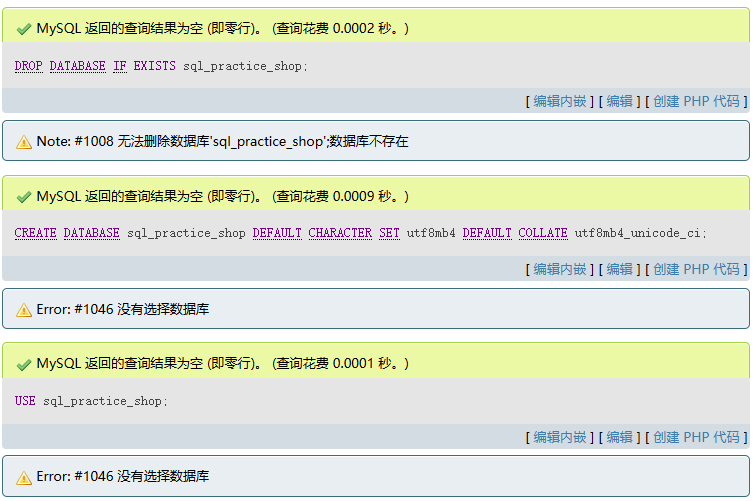

## 第 2 部分：创建数据表

### 2.1 创建数据表
创建 customers、products、orders、order_items 四张练习表。
```sql
-- 业务场景：一个简单商城
-- customers   客户表
-- products    产品表
-- orders      订单表
-- order_items 订单明细表

DROP TABLE IF EXISTS order_items;
DROP TABLE IF EXISTS orders;
DROP TABLE IF EXISTS products;
DROP TABLE IF EXISTS customers;

CREATE TABLE customers (
  id INT AUTO_INCREMENT PRIMARY KEY,
  name VARCHAR(100) NOT NULL,
  city VARCHAR(80) NOT NULL,
  email VARCHAR(160) NOT NULL UNIQUE,
  level ENUM('normal', 'vip') NOT NULL DEFAULT 'normal',
  created_at DATE NOT NULL
) ENGINE=InnoDB;

CREATE TABLE products (
  id INT AUTO_INCREMENT PRIMARY KEY,
  name VARCHAR(120) NOT NULL,
  category VARCHAR(80) NOT NULL,
  price DECIMAL(10, 2) NOT NULL,
  stock INT NOT NULL DEFAULT 0,
  status ENUM('active', 'inactive') NOT NULL DEFAULT 'active'
) ENGINE=InnoDB;

CREATE TABLE orders (
  id INT AUTO_INCREMENT PRIMARY KEY,
  customer_id INT NOT NULL,
  order_no VARCHAR(40) NOT NULL UNIQUE,
  status ENUM('pending', 'paid', 'shipped', 'cancelled') NOT NULL DEFAULT 'pending',
  order_date DATE NOT NULL,
  note VARCHAR(255),
  CONSTRAINT fk_orders_customer
    FOREIGN KEY (customer_id) REFERENCES customers(id)
    ON UPDATE CASCADE
    ON DELETE RESTRICT
) ENGINE=InnoDB;

CREATE TABLE order_items (
  id INT AUTO_INCREMENT PRIMARY KEY,
  order_id INT NOT NULL,
  product_id INT NOT NULL,
  quantity INT NOT NULL,
  unit_price DECIMAL(10, 2) NOT NULL,
  CONSTRAINT fk_order_items_order
    FOREIGN KEY (order_id) REFERENCES orders(id)
    ON UPDATE CASCADE
    ON DELETE CASCADE,
  CONSTRAINT fk_order_items_product
    FOREIGN KEY (product_id) REFERENCES products(id)
    ON UPDATE CASCADE
    ON DELETE RESTRICT
) ENGINE=InnoDB;
```
**运行结果截图：** `docs/screenshots/02-01.png`

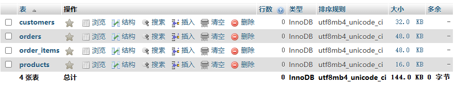

## 第 3 部分：插入测试数据

### 3.1 插入测试数据
插入一批商城测试数据，后续 SELECT / JOIN / GROUP BY 都基于这些数据。
```sql
INSERT INTO customers (name, city, email, level, created_at) VALUES
('Alice Wang', 'Toronto', 'alice@example.com', 'vip', '2024-01-10'),
('Bob Chen', 'Vancouver', 'bob@example.com', 'normal', '2024-02-15'),
('Cindy Li', 'Montreal', 'cindy@example.com', 'vip', '2024-03-20'),
('David Zhang', 'Calgary', 'david@example.com', 'normal', '2024-04-05'),
('Eva Liu', 'Toronto', 'eva@example.com', 'normal', '2024-04-18'),
('Frank Sun', 'Ottawa', 'frank@example.com', 'vip', '2024-05-01');

INSERT INTO products (name, category, price, stock, status) VALUES
('Composite Decking Board', 'Decking', 29.90, 500, 'active'),
('Decking Starter Clip', 'Accessories', 0.45, 3000, 'active'),
('Decking Joist', 'Substructure', 12.50, 800, 'active'),
('Wall Cladding Panel', 'Cladding', 35.80, 260, 'active'),
('Corner Trim', 'Accessories', 8.90, 600, 'active'),
('Old Sample Board', 'Sample', 3.00, 0, 'inactive'),
('Fascia Board', 'Decking', 18.60, 180, 'active'),
('Screw Pack', 'Accessories', 6.50, 1200, 'active');

INSERT INTO orders (customer_id, order_no, status, order_date, note) VALUES
(1, 'SO20240501001', 'paid', '2024-05-01', 'VIP customer'),
(2, 'SO20240503001', 'pending', '2024-05-03', NULL),
(3, 'SO20240505001', 'shipped', '2024-05-05', 'Urgent delivery'),
(1, 'SO20240510001', 'cancelled', '2024-05-10', 'Customer changed plan'),
(5, 'SO20240512001', 'paid', '2024-05-12', NULL),
(6, 'SO20240515001', 'paid', '2024-05-15', 'Repeat customer'),
(4, 'SO20240518001', 'shipped', '2024-05-18', NULL),
(3, 'SO20240520001', 'paid', '2024-05-20', NULL);

INSERT INTO order_items (order_id, product_id, quantity, unit_price) VALUES
(1, 1, 20, 29.90),
(1, 2, 200, 0.45),
(1, 8, 5, 6.50),

(2, 4, 10, 35.80),
(2, 5, 8, 8.90),

(3, 1, 30, 29.90),
(3, 3, 12, 12.50),
(3, 2, 300, 0.45),

(4, 6, 5, 3.00),

(5, 7, 15, 18.60),
(5, 8, 3, 6.50),

(6, 4, 12, 35.80),
(6, 5, 10, 8.90),
(6, 8, 2, 6.50),

(7, 1, 25, 29.90),
(7, 3, 10, 12.50),

(8, 1, 10, 29.90),
(8, 4, 6, 35.80),
(8, 5, 4, 8.90);
```
**运行结果截图：** `docs/screenshots/03-01.png`

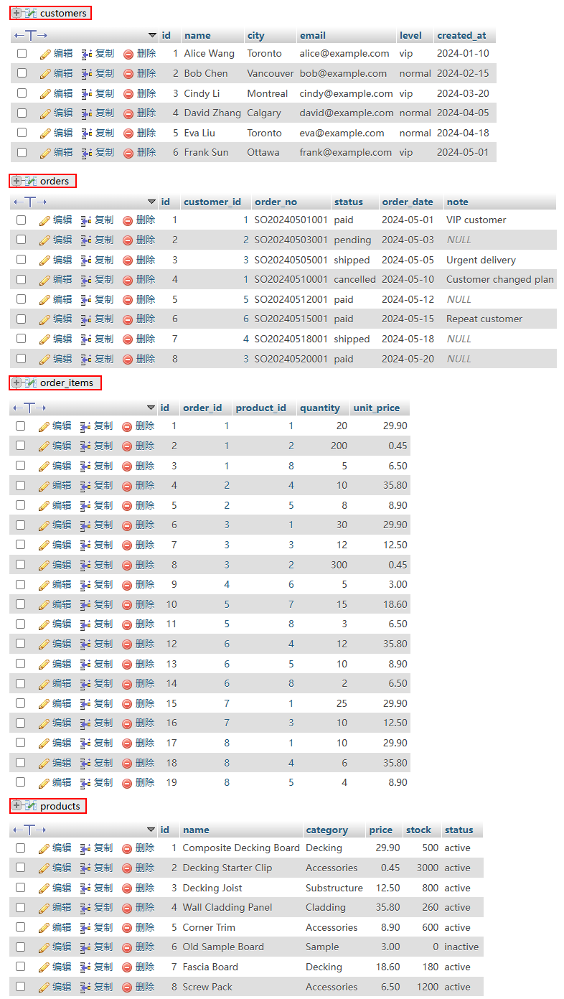

## 第 4 部分：基础查询 SELECT

### 4.1 查看所有客户
```sql
SELECT *
FROM customers;
```
**运行结果截图：** `docs/screenshots/04-01.png`

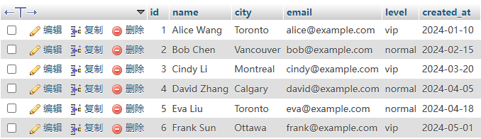

### 4.2 只查询客户姓名、城市、邮箱
```sql
SELECT name, city, email
FROM customers;
```
**运行结果截图：** `docs/screenshots/04-02.png`

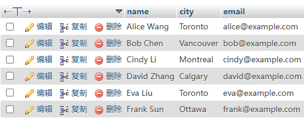

### 4.3 查询产品名称、分类、价格，并给字段起别名
```sql
SELECT
  name AS product_name,
  category AS product_category,
  price AS unit_price
FROM products;
```
**运行结果截图：** `docs/screenshots/04-03.png`

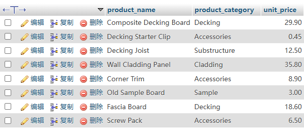

### 4.4 查询前 5 个产品
```sql
SELECT *
FROM products
LIMIT 5;
```
**运行结果截图：** `docs/screenshots/04-04.png`

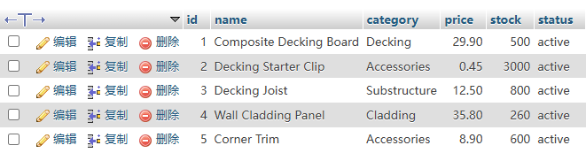

## 第 5 部分：条件查询 WHERE

### 5.1 查询 Toronto 的客户
```sql
SELECT *
FROM customers
WHERE city = 'Toronto';
```
**运行结果截图：** `docs/screenshots/05-01.png`

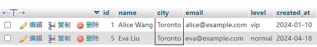

### 5.2 查询 VIP 客户
```sql
SELECT *
FROM customers
WHERE level = 'vip';
```
**运行结果截图：** `docs/screenshots/05-02.png`

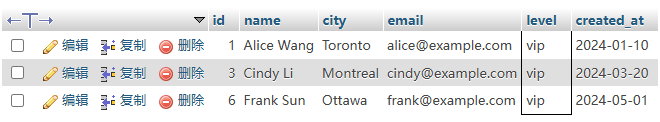

### 5.3 查询价格大于 20 的产品
```sql
SELECT *
FROM products
WHERE price > 20;
```
**运行结果截图：** `docs/screenshots/05-03.png`

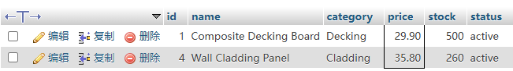

### 5.4 查询库存大于 0 且状态为 active 的产品
```sql
SELECT *
FROM products
WHERE stock > 0
  AND status = 'active';
```
**运行结果截图：** `docs/screenshots/05-04.png`

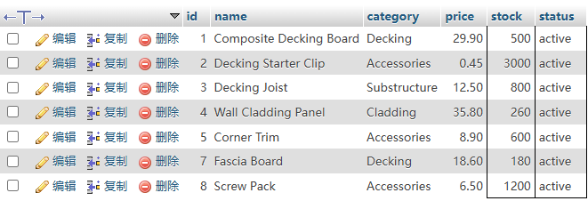

### 5.5 查询 Decking 或 Accessories 分类的产品
```sql
SELECT *
FROM products
WHERE category IN ('Decking', 'Accessories');
```
**运行结果截图：** `docs/screenshots/05-05.png`

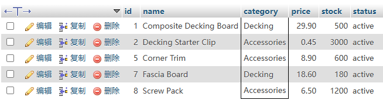

### 5.6 模糊查询：查询名称中包含 Board 的产品
```sql
SELECT *
FROM products
WHERE name LIKE '%Board%';
```
**运行结果截图：** `docs/screenshots/05-06.png`

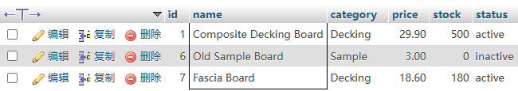

### 5.7 查询 2024-05-10 之后的订单
```sql
SELECT *
FROM orders
WHERE order_date > '2024-05-10';
```
**运行结果截图：** `docs/screenshots/05-07.png`

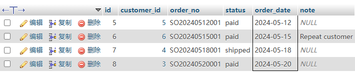

## 第 6 部分：排序 ORDER BY

### 6.1 产品按价格从低到高排序
```sql
SELECT *
FROM products
ORDER BY price ASC;
```
**运行结果截图：** `docs/screenshots/06-01.png`

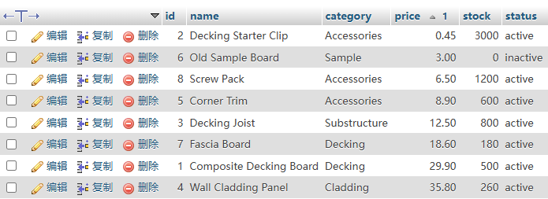

### 6.2 产品按库存从高到低排序
```sql
SELECT *
FROM products
ORDER BY stock DESC;
```
**运行结果截图：** `docs/screenshots/06-02.png`

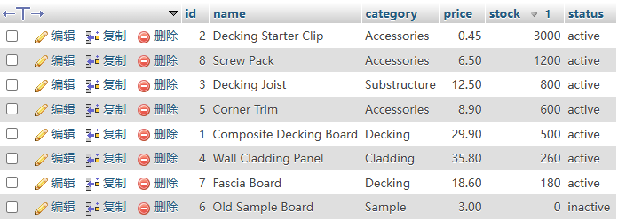

### 6.3 订单先按状态排序，再按日期倒序排序
```sql
SELECT *
FROM orders
ORDER BY status ASC, order_date DESC;
```
**运行结果截图：** `docs/screenshots/06-03.png`

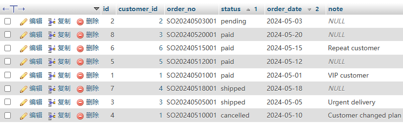

## 第 7 部分：聚合函数 COUNT / SUM / AVG / MAX / MIN

### 7.1 统计客户总数
```sql
SELECT COUNT(*) AS customer_count
FROM customers;
```
**运行结果截图：** `docs/screenshots/07-01.png`

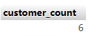

### 7.2 统计产品平均价格
```sql
SELECT AVG(price) AS average_price
FROM products;
```
**运行结果截图：** `docs/screenshots/07-02.png`

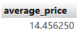

### 7.3 查询最高产品价格和最低产品价格
```sql
SELECT
  MAX(price) AS max_price,
  MIN(price) AS min_price
FROM products;
```
**运行结果截图：** `docs/screenshots/07-03.png`

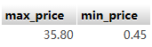

### 7.4 统计所有产品总库存
```sql
SELECT SUM(stock) AS total_stock
FROM products;
```
**运行结果截图：** `docs/screenshots/07-04.png`

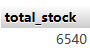

## 第 8 部分：分组 GROUP BY

### 8.1 按城市统计客户数量
```sql
SELECT
  city,
  COUNT(*) AS customer_count
FROM customers
GROUP BY city
ORDER BY customer_count DESC;
```
**运行结果截图：** `docs/screenshots/08-01.png`

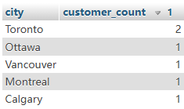

### 8.2 按产品分类统计产品数量
```sql
SELECT
  category,
  COUNT(*) AS product_count
FROM products
GROUP BY category
ORDER BY product_count DESC;
```
**运行结果截图：** `docs/screenshots/08-02.png`

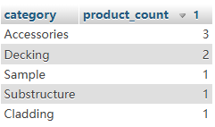

### 8.3 按订单状态统计订单数量
```sql
SELECT
  status,
  COUNT(*) AS order_count
FROM orders
GROUP BY status;
```
**运行结果截图：** `docs/screenshots/08-03.png`

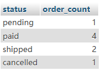

### 8.4 按产品分类统计平均价格
```sql
SELECT
  category,
  AVG(price) AS average_price
FROM products
GROUP BY category
ORDER BY average_price DESC;
```
**运行结果截图：** `docs/screenshots/08-04.png`

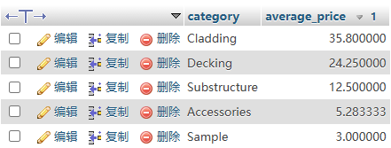

## 第 9 部分：HAVING 分组后筛选

### 9.1 查询客户数量大于 1 的城市
```sql
SELECT
  city,
  COUNT(*) AS customer_count
FROM customers
GROUP BY city
HAVING COUNT(*) > 1;
```
**运行结果截图：** `docs/screenshots/09-01.png`

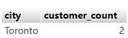

### 9.2 查询平均价格大于 10 的产品分类
```sql
SELECT
  category,
  AVG(price) AS average_price
FROM products
GROUP BY category
HAVING AVG(price) > 10;
```
**运行结果截图：** `docs/screenshots/09-02.png`

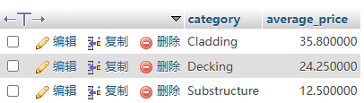

## 第 10 部分：单表 INSERT / UPDATE / DELETE

### 10.1 新增一个客户
```sql
INSERT INTO customers (name, city, email, level, created_at)
VALUES ('Grace Yang', 'Toronto', 'grace@example.com', 'normal', CURDATE());
```
**运行结果截图：** `docs/screenshots/10-01.png`

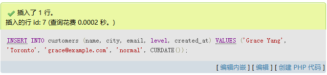

### 10.2 查看刚新增的客户
```sql
SELECT *
FROM customers
WHERE email = 'grace@example.com';
```
**运行结果截图：** `docs/screenshots/10-02.png`


### 10.3 修改 Grace 的会员等级
```sql
UPDATE customers
SET level = 'vip'
WHERE email = 'grace@example.com';
```
**运行结果截图：** `docs/screenshots/10-03.png`

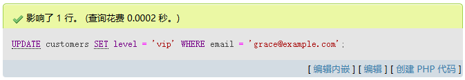

### 10.4 删除 Grace
```sql
DELETE FROM customers
WHERE email = 'grace@example.com';
```
**运行结果截图：** `docs/screenshots/10-04.png`


## 第 11 部分：连接查询 JOIN

### 11.1 查询订单及对应客户信息
```sql
SELECT
  o.id AS order_id,
  o.order_no,
  o.status,
  o.order_date,
  c.name AS customer_name,
  c.city
FROM orders o
INNER JOIN customers c ON o.customer_id = c.id
ORDER BY o.order_date DESC;
```
**运行结果截图：** `docs/screenshots/11-01.png`

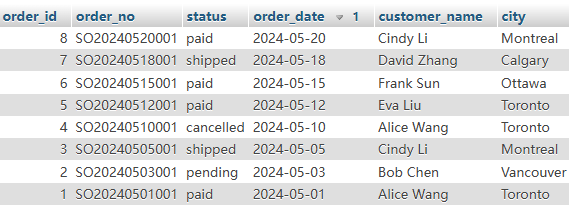

### 11.2 查询订单明细，包括订单号、客户、产品、数量、单价
```sql
SELECT
  o.order_no,
  c.name AS customer_name,
  p.name AS product_name,
  oi.quantity,
  oi.unit_price
FROM order_items oi
INNER JOIN orders o ON oi.order_id = o.id
INNER JOIN customers c ON o.customer_id = c.id
INNER JOIN products p ON oi.product_id = p.id
ORDER BY o.order_date DESC, o.order_no;
```
**运行结果截图：** `docs/screenshots/11-02.png`

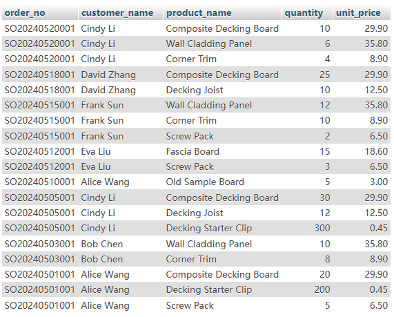

### 11.3 计算每条订单明细的小计金额
```sql
SELECT
  o.order_no,
  p.name AS product_name,
  oi.quantity,
  oi.unit_price,
  oi.quantity * oi.unit_price AS line_total
FROM order_items oi
INNER JOIN orders o ON oi.order_id = o.id
INNER JOIN products p ON oi.product_id = p.id;
```
**运行结果截图：** `docs/screenshots/11-03.png`

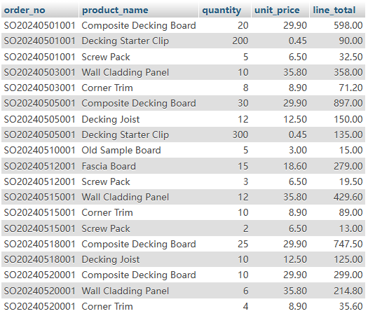

### 11.4 查询每个订单的总金额
```sql
SELECT
  o.order_no,
  c.name AS customer_name,
  o.status,
  SUM(oi.quantity * oi.unit_price) AS order_total
FROM orders o
INNER JOIN customers c ON o.customer_id = c.id
INNER JOIN order_items oi ON o.id = oi.order_id
GROUP BY o.id, o.order_no, c.name, o.status
ORDER BY order_total DESC;
```
**运行结果截图：** `docs/screenshots/11-04.png`

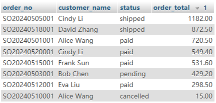

### 11.5 查询已付款订单的总金额
```sql
SELECT
  o.order_no,
  c.name AS customer_name,
  SUM(oi.quantity * oi.unit_price) AS order_total
FROM orders o
INNER JOIN customers c ON o.customer_id = c.id
INNER JOIN order_items oi ON o.id = oi.order_id
WHERE o.status = 'paid'
GROUP BY o.id, o.order_no, c.name
ORDER BY order_total DESC;
```
**运行结果截图：** `docs/screenshots/11-05.png`

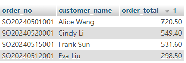

## 第 12 部分：LEFT JOIN

### 12.1 查询所有客户，以及他们的订单数量
```sql
SELECT
  c.id,
  c.name,
  c.city,
  COUNT(o.id) AS order_count
FROM customers c
LEFT JOIN orders o ON c.id = o.customer_id
GROUP BY c.id, c.name, c.city
ORDER BY order_count DESC;
```
**运行结果截图：** `docs/screenshots/12-01.png`

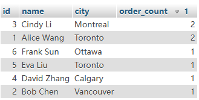

### 12.2 查询没有下过订单的客户
```sql
SELECT
  c.*
FROM customers c
LEFT JOIN orders o ON c.id = o.customer_id
WHERE o.id IS NULL;
```
**运行结果截图：** `docs/screenshots/12-02.png`


### 12.3 查询所有产品，以及被购买的次数
```sql
SELECT
  p.id,
  p.name,
  p.category,
  COUNT(oi.id) AS sold_line_count
FROM products p
LEFT JOIN order_items oi ON p.id = oi.product_id
GROUP BY p.id, p.name, p.category
ORDER BY sold_line_count DESC;
```
**运行结果截图：** `docs/screenshots/12-03.png`

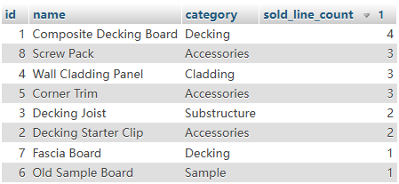

## 第 13 部分：子查询 Subquery

### 13.1 查询价格高于平均价格的产品
```sql
SELECT *
FROM products
WHERE price > (
  SELECT AVG(price)
  FROM products
);
```
**运行结果截图：** `docs/screenshots/13-01.png`

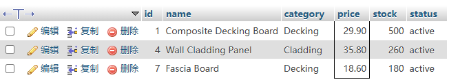

### 13.2 查询下过订单的客户
```sql
SELECT *
FROM customers
WHERE id IN (
  SELECT customer_id
  FROM orders
);
```
**运行结果截图：** `docs/screenshots/13-02.png`

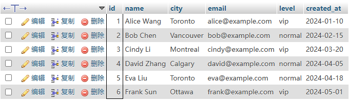

### 13.3 查询没有下过订单的客户
```sql
SELECT *
FROM customers
WHERE id NOT IN (
  SELECT customer_id
  FROM orders
);
```
**运行结果截图：** `docs/screenshots/13-03.png`

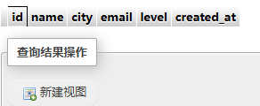

## 第 14 部分：CASE WHEN 条件判断

### 14.1 根据价格给产品打标签
```sql
SELECT
  name,
  price,
  CASE
    WHEN price >= 30 THEN 'high'
    WHEN price >= 10 THEN 'middle'
    ELSE 'low'
  END AS price_level
FROM products;
```
**运行结果截图：** `docs/screenshots/14-01.png`

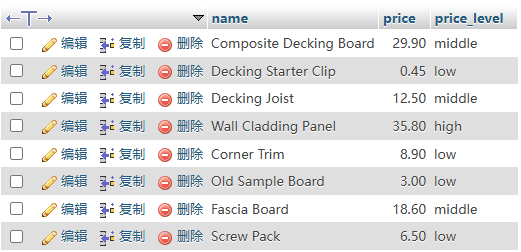

### 14.2 根据订单状态显示中文状态
```sql
SELECT
  order_no,
  status,
  CASE status
    WHEN 'pending' THEN '待付款'
    WHEN 'paid' THEN '已付款'
    WHEN 'shipped' THEN '已发货'
    WHEN 'cancelled' THEN '已取消'
    ELSE '未知'
  END AS status_cn
FROM orders;
```
**运行结果截图：** `docs/screenshots/14-02.png`

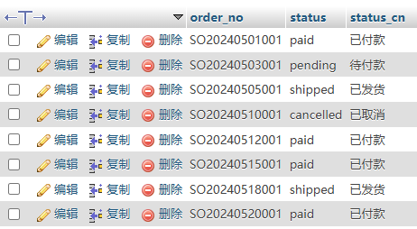

## 第 15 部分：日期函数

### 15.1 查询订单日期、年份、月份
```sql
SELECT
  order_no,
  order_date,
  YEAR(order_date) AS order_year,
  MONTH(order_date) AS order_month
FROM orders;
```
**运行结果截图：** `docs/screenshots/15-01.png`

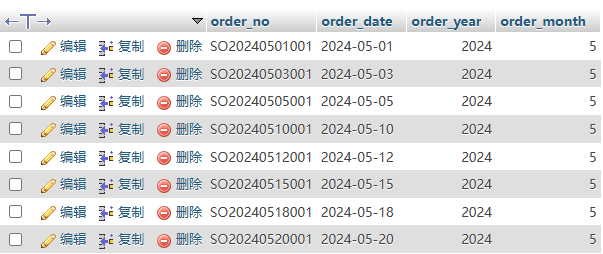

### 15.2 按月份统计订单数量
```sql
SELECT
  DATE_FORMAT(order_date, '%Y-%m') AS order_month,
  COUNT(*) AS order_count
FROM orders
GROUP BY DATE_FORMAT(order_date, '%Y-%m')
ORDER BY order_month;
```
**运行结果截图：** `docs/screenshots/15-02.png`

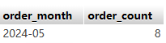

### 15.3 查询最近 30 天内创建的客户
```sql
SELECT *
FROM customers
WHERE created_at >= DATE_SUB(CURDATE(), INTERVAL 30 DAY);
```
**运行结果截图：** `docs/screenshots/15-03.png`


## 第 16 部分：常用业务查询综合练习

### 16.1 查询销售额最高的前 5 个产品
```sql
SELECT
  p.id,
  p.name,
  p.category,
  SUM(oi.quantity) AS total_quantity,
  SUM(oi.quantity * oi.unit_price) AS total_sales
FROM products p
INNER JOIN order_items oi ON p.id = oi.product_id
INNER JOIN orders o ON oi.order_id = o.id
WHERE o.status IN ('paid', 'shipped')
GROUP BY p.id, p.name, p.category
ORDER BY total_sales DESC
LIMIT 5;
```
**运行结果截图：** `docs/screenshots/16-01.png`

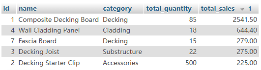

### 16.2 查询每个客户的累计消费金额
```sql
SELECT
  c.id,
  c.name,
  c.city,
  COALESCE(SUM(oi.quantity * oi.unit_price), 0) AS total_spent
FROM customers c
LEFT JOIN orders o
  ON c.id = o.customer_id
  AND o.status IN ('paid', 'shipped')
LEFT JOIN order_items oi
  ON o.id = oi.order_id
GROUP BY c.id, c.name, c.city
ORDER BY total_spent DESC;
```
**运行结果截图：** `docs/screenshots/16-02.png`

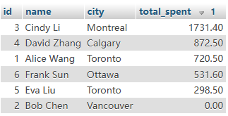

### 16.3 查询累计消费金额大于 500 的客户
```sql
SELECT
  c.id,
  c.name,
  SUM(oi.quantity * oi.unit_price) AS total_spent
FROM customers c
INNER JOIN orders o ON c.id = o.customer_id
INNER JOIN order_items oi ON o.id = oi.order_id
WHERE o.status IN ('paid', 'shipped')
GROUP BY c.id, c.name
HAVING SUM(oi.quantity * oi.unit_price) > 500
ORDER BY total_spent DESC;
```
**运行结果截图：** `docs/screenshots/16-03.png`

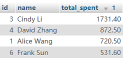

### 16.4 查询每个城市的销售额
```sql
SELECT
  c.city,
  SUM(oi.quantity * oi.unit_price) AS city_sales
FROM customers c
INNER JOIN orders o ON c.id = o.customer_id
INNER JOIN order_items oi ON o.id = oi.order_id
WHERE o.status IN ('paid', 'shipped')
GROUP BY c.city
ORDER BY city_sales DESC;
```
**运行结果截图：** `docs/screenshots/16-04.png`

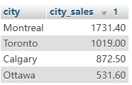

### 16.5 查询每个订单的产品种类数和总件数
```sql
SELECT
  o.order_no,
  COUNT(DISTINCT oi.product_id) AS product_type_count,
  SUM(oi.quantity) AS total_quantity
FROM orders o
INNER JOIN order_items oi ON o.id = oi.order_id
GROUP BY o.id, o.order_no
ORDER BY total_quantity DESC;
```
**运行结果截图：** `docs/screenshots/16-05.png`

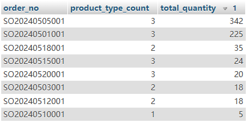

## 第 17 部分：索引练习

### 17.1 给订单日期添加普通索引
```sql
CREATE INDEX idx_orders_order_date ON orders(order_date);
```
**运行结果截图：** `docs/screenshots/17-01.png`

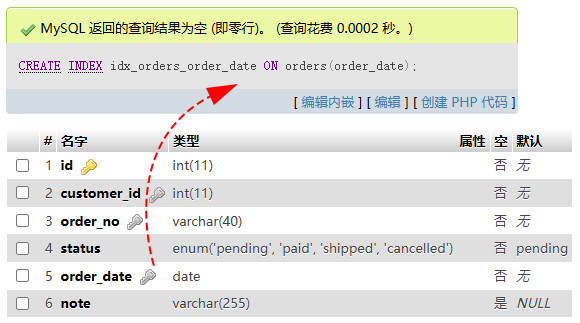

### 17.2 给订单状态添加普通索引
```sql
CREATE INDEX idx_orders_status ON orders(status);
```
**运行结果截图：** `docs/screenshots/17-02.png`

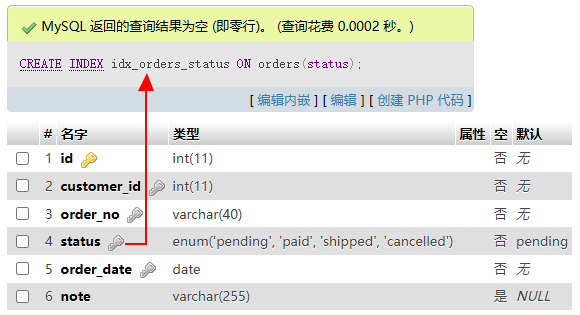

### 17.3 给产品分类添加普通索引
```sql
CREATE INDEX idx_products_category ON products(category);
```
**运行结果截图：** `docs/screenshots/17-03.png`


### 17.4 使用 EXPLAIN 查看 SQL 执行计划
```sql
EXPLAIN
SELECT *
FROM orders
WHERE status = 'paid'
ORDER BY order_date DESC;
```
**运行结果截图：** `docs/screenshots/17-04.png`


## 第 18 部分：事务练习 Transaction

### 18.1 事务练习：创建订单并扣减库存
用事务一次完成新增订单、插入订单明细、扣减库存，最后 COMMIT 提交。
```sql
-- 场景：创建订单，同时扣减库存

START TRANSACTION;

INSERT INTO orders (customer_id, order_no, status, order_date, note)
VALUES (2, 'SO20240601001', 'paid', CURDATE(), 'Transaction test order');

SET @new_order_id = LAST_INSERT_ID();

INSERT INTO order_items (order_id, product_id, quantity, unit_price)
VALUES
(@new_order_id, 1, 2, 29.90),
(@new_order_id, 8, 1, 6.50);

UPDATE products
SET stock = stock - 2
WHERE id = 1;

UPDATE products
SET stock = stock - 1
WHERE id = 8;

COMMIT;
```
**运行结果截图：** `docs/screenshots/18-01.png`


### 18.2 查看事务执行后的新订单
验证事务执行后订单、订单明细和产品信息是否正确关联。
```sql
SELECT
  o.order_no,
  o.status,
  p.name AS product_name,
  oi.quantity,
  oi.unit_price
FROM orders o
INNER JOIN order_items oi ON o.id = oi.order_id
INNER JOIN products p ON oi.product_id = p.id
WHERE o.order_no = 'SO20240601001';
```
**运行结果截图：** `docs/screenshots/18-02.png`


## 第 19 部分：视图 View

### 19.1 创建订单汇总视图
把订单、客户、订单金额汇总逻辑封装成视图，后续可以直接查询视图。
```sql
DROP VIEW IF EXISTS v_order_summary;

CREATE VIEW v_order_summary AS
SELECT
  o.id AS order_id,
  o.order_no,
  o.status,
  o.order_date,
  c.name AS customer_name,
  c.city,
  SUM(oi.quantity * oi.unit_price) AS order_total
FROM orders o
INNER JOIN customers c ON o.customer_id = c.id
INNER JOIN order_items oi ON o.id = oi.order_id
GROUP BY o.id, o.order_no, o.status, o.order_date, c.name, c.city;
```
**运行结果截图：** `docs/screenshots/19-01.png`


### 19.2 查询订单汇总视图
像查询普通表一样查询视图。
```sql
SELECT *
FROM v_order_summary
ORDER BY order_date DESC;
```
**运行结果截图：** `docs/screenshots/19-02.png`


## 第 20 部分：自己练习题
这些题目建议先自己写 SQL，再对照前面的示例思路检查。

- 练习 1：查询所有 active 状态的产品
- 练习 2：查询价格在 10 到 30 之间的产品
- 练习 3：查询每个客户的订单数量
- 练习 4：查询所有 paid 订单的订单号、客户名、订单日期
- 练习 5：查询每个产品分类的产品数量和平均价格
- 练习 6：查询购买过 Composite Decking Board 的客户
- 练习 7：查询销售额最高的产品
- 练习 8：查询没有任何订单的客户
- 练习 9：查询订单金额大于 500 的订单
- 练习 10：查询每个城市的客户数量和销售额